# Ton Wallet

this project is part of Ton [Wallet Contest](https://github.com/ton-community/wallet-contest)

## Libraries used

In order to work with Ton Network the [tonutils-go](https://github.com/xssnick/tonutils-go) was used.

Scanner library [zxing-android-embedded](https://github.com/journeyapps/zxing-android-embedded)

## Roadmap

Gomobile allows to write also iOS applications.
The initial plan for this contest was to provide also ios application using Kotlin Multiplatform but
this plan was too ambitious. The implementation of ios application will be done as a follow up stage.

### Instrumentation Tests

in folder androidTest run using android studio

### Unit Tests

in folder unitTest run using android studio
address is EQB9sKy3ziopLGzwS8sKtz1QIt0EiPfPVSf30A5UrXHVvtjc

## Screens

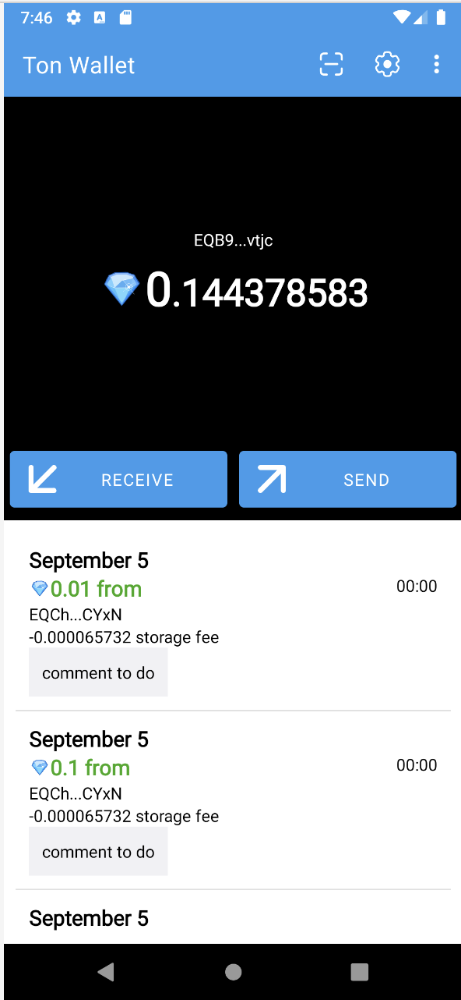

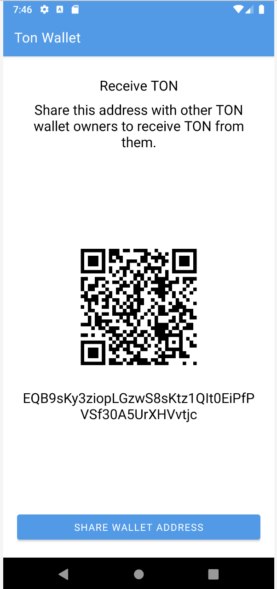

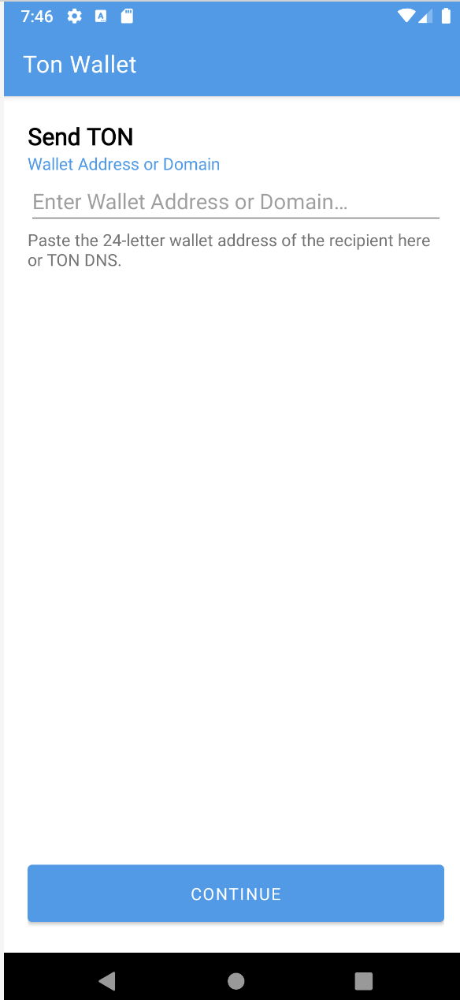

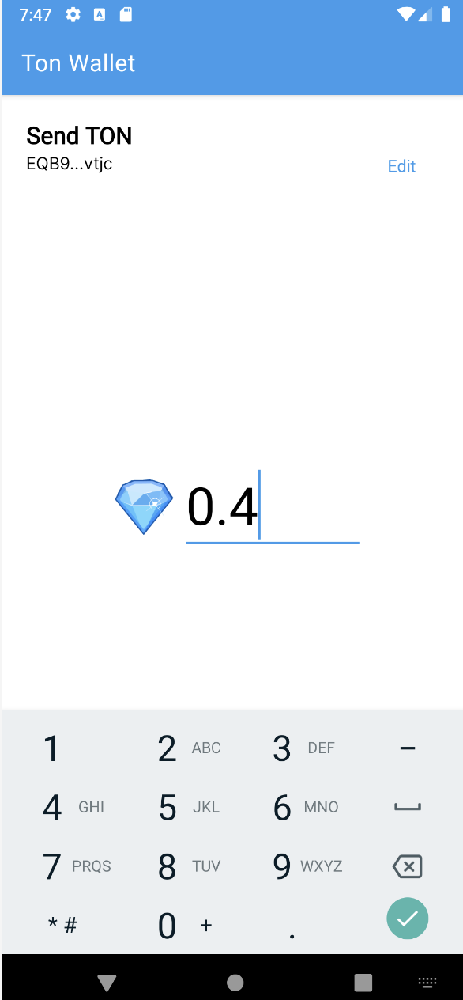

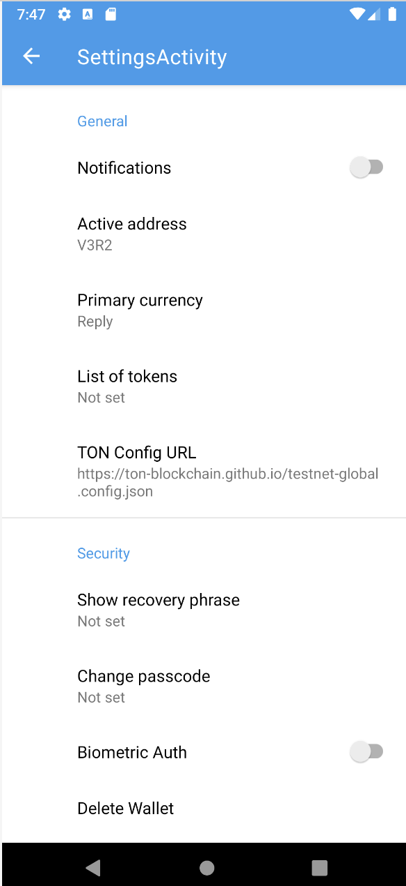

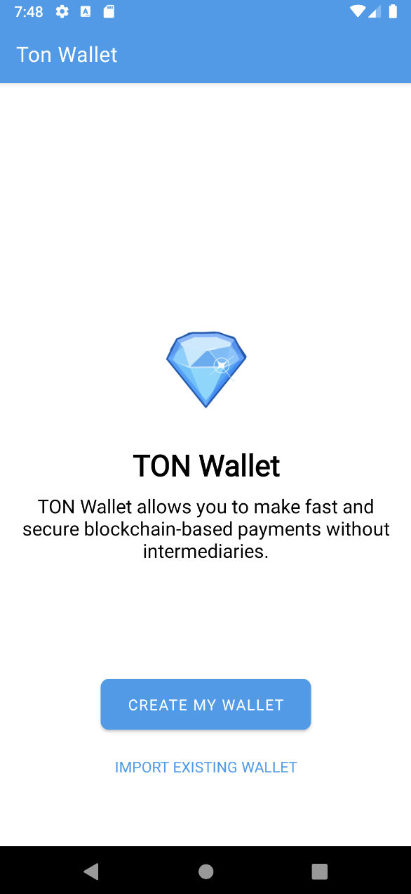

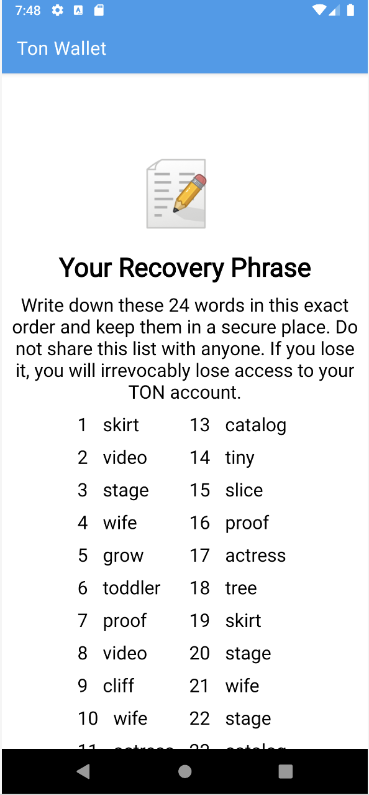

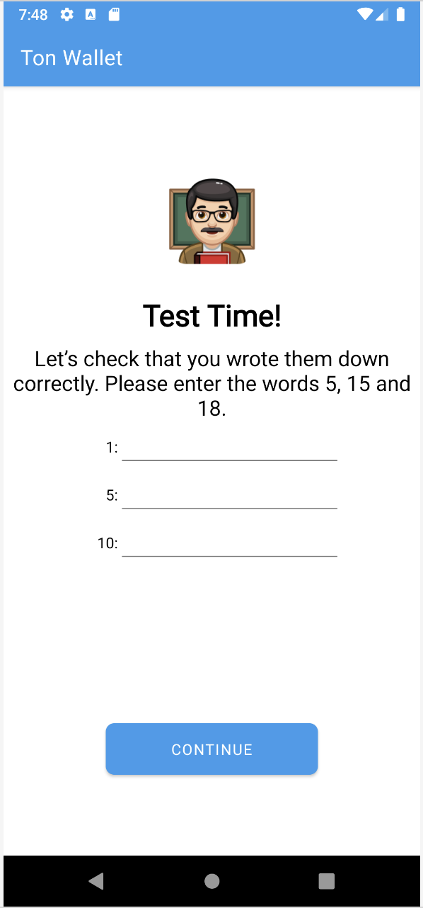

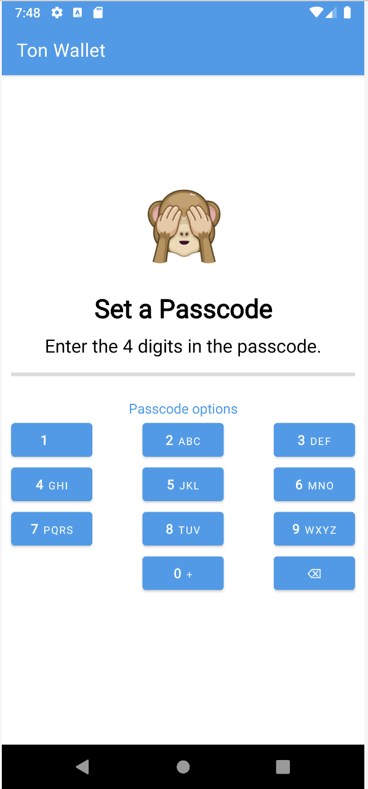

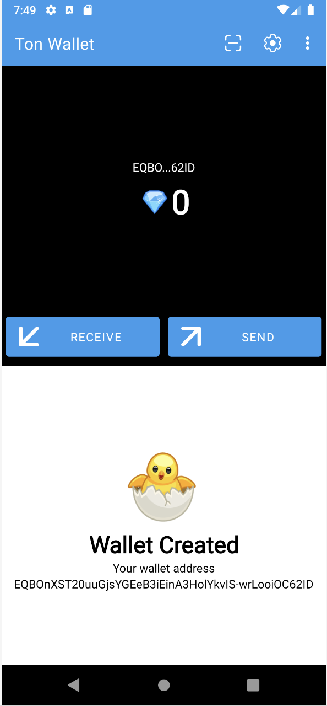

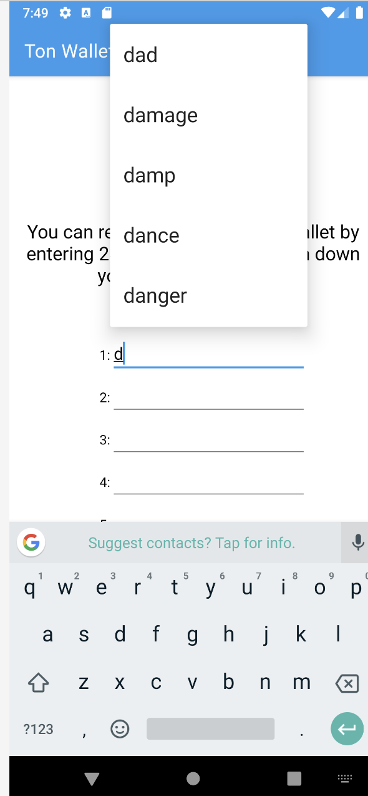

### Todo:

- [ ] security code form
  - [x] draw non active dots
  - [x] connect dots to the logic
  - [x] it opens a form event the code is not correct
  - [ ] fingerprint authentication 
  - [x] support for delete characters
- [ ] set secret code dialog
  - [ ] make the same that I have done for pin code form
  - [ ] set 6 digits option
- [ ] settings pages
  - [x] make "delete wallet" to be red
  - [x] use better components for settings
  - [x] list of wallet types
  - [x] use wallet types in code
  - [ ] connect elements with secret phrase
  - [ ] make feature to enter pin code
- [ ] wallet activity
  - [ ] show transactions and new icon
  - [x] format list
  - [x] reverse order
  - [ ] store transaction in case there is no internet
  - [ ] can we check the network in background to see if money arrived?
  - [ ] can we show status message on the top as required in the mock?
  - [ ] can we better format icons on the buttons?
  - [x] layout round corners
  - [ ] for some wallets not all transactions are being shown
  - [ ] storage fee and comments are not being shown
- [ ] send dialog
  - [x] add paste icon
  - [ ] use paste icon
- [ ] receive dialog
  - make fonts as provided 
- [ ] security
  - [ ] do not show secret phrase to logs
  - [ ] can se use better method to store the wallet? e.g. secret phrase?
  - [ ] can we cipher it in the application?
- [ ] link for the external intents as described in the requirements

### Links:

- [Figma Design](https://www.figma.com/file/KYK17IdM2ldAAZL540G2hV/TON-Wallet-%C2%B7-Android?type=design&node-id=0-1&t=vzLRrmDAN2Ki4yqm-0)
- [репозиторий конкурса](https://github.com/ton-community/wallet-contest)
    - `git clone git@github.com-maxistar:maxistar/tonwallet.git`
- [video lessons](https://www.youtube.com/watch?v=GcqFhoUuNNI)
- [репозиторий приложения](https://github.com/maxistar/tonwallet)
- [ADNL протокол](https://docs.ton.org/develop/dapps/apis/adnl)
- [tonlib](https://github.com/ton-blockchain/ton/tree/master/example/android)

