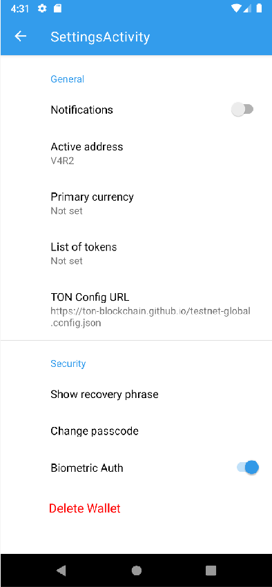
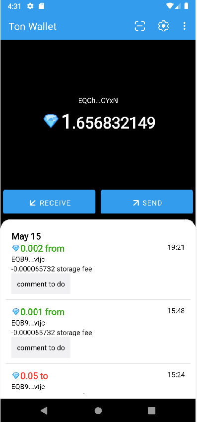
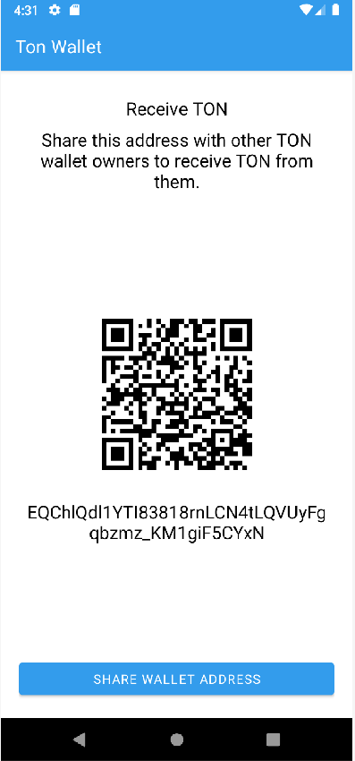
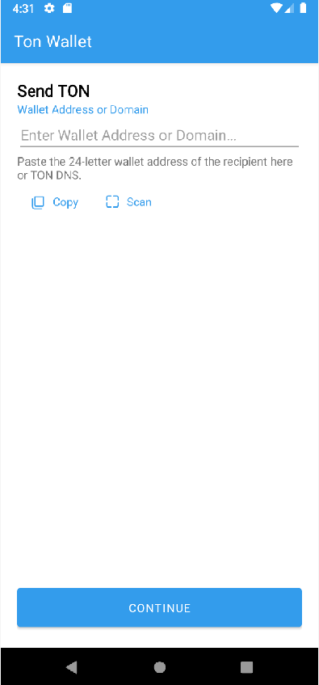
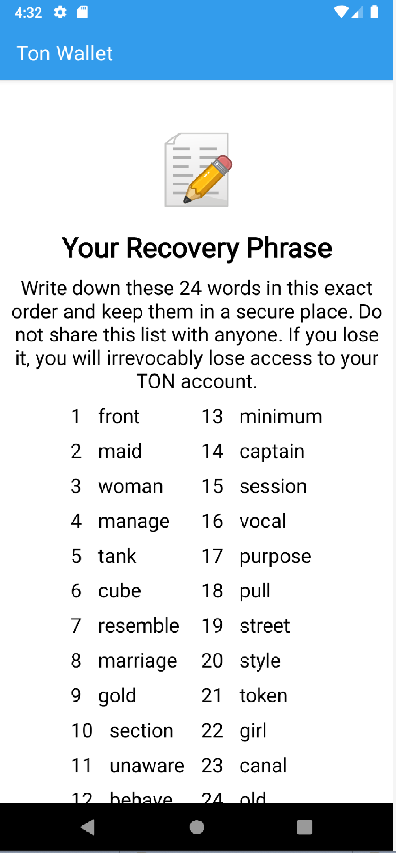
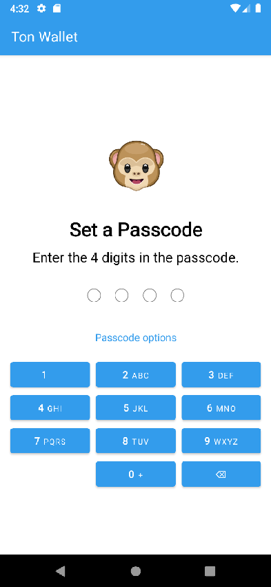
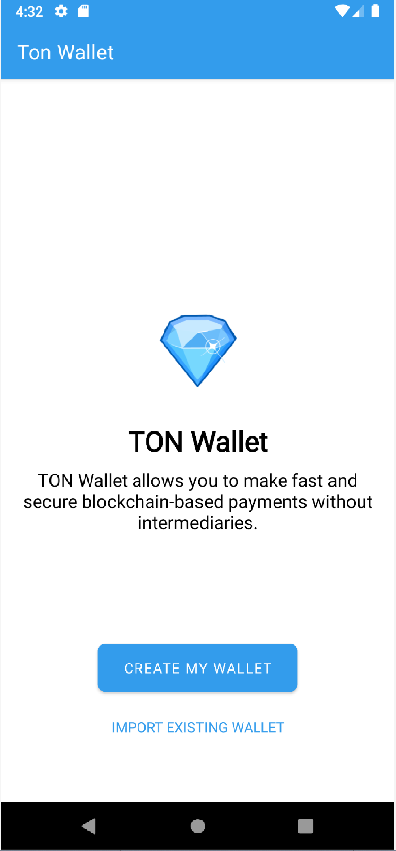
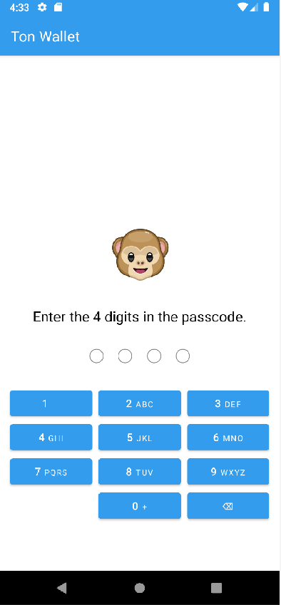
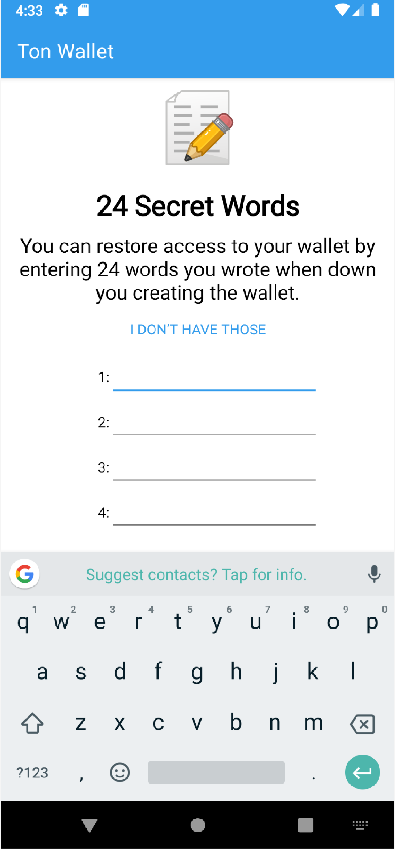

# Ton Wallet

this project is part of Ton [Wallet Contest](https://github.com/ton-community/wallet-contest)

## Libraries used

In order to work with Ton Network the [tonutils-go](https://github.com/xssnick/tonutils-go) was used.

Scanner library [zxing-android-embedded](https://github.com/journeyapps/zxing-android-embedded)

Animations are being done with [Airbnb Lottie](https://github.com/airbnb/lottie-android)

## How to compile 

An application was developed and compiled using Android Studio 2022.2.1 Patch 1

In order to compile aar library golang installation is needed. The complied version is included to source code.

The latest compiled version is uploaded [here](https://github.com/maxistar/tonwalletapp/actions/workflows/generate-apk-aab-debug-release.yml)

## Gomobile

Gomobile is a tool for building and running mobile apps written in Go.

To install

```shell
go install golang.org/x/mobile/cmd/gomobile@latest
gomobile init
```

compiled wallet.aar already included to the repository but it is always good idea to compile the one from scratch.

in order to compile aar library do the following:

```shell
cd gomobile
gomobile bind -o ../app/wallet.aar -target=android ./wallet
```

see more on [gomoble documentation page](https://pkg.go.dev/golang.org/x/mobile/cmd/gomobile)


## Roadmap

### Kotlin Multiplatform

The initial plan for this contest was to provide also iOS application using Kotlin Multiplatform but
this plan was too ambitious. The implementation of ios application will be done as a follow up stage.

### Gomobile vs Android Native Code

Golang is being compiled into native android code but can potentially create not necessary overhead.
The application is created the way that golang code can be easily replaced with C/C++ implementation in the future.

### Merkle Proof

At the moment is not implemented. Planned to be added in the future versions.

### Security

At the moment wallet seed is stored in the application as plain text this will be fixed in future versions


### Instrumentation Tests

in folder androidTest run using android studio

### Unit Tests

in folder unitTest run using android studio
address is EQB9sKy3ziopLGzwS8sKtz1QIt0EiPfPVSf30A5UrXHVvtjc

## Screens



















## What is not done

- transactions comments are not being displayed. Comment is not part of transaction Class in tonutils-go this should be implemented there first
- there is a but in tonutils-go which is not showing some transactions


### Todo:

- [x] security code form
- [ ] wallet activity
  - [ ] store transaction in case there is no internet
  - [ ] can we check the network in background to see if money arrived?
  - [ ] can we show status message on the top as required in the mock?
  - [ ] can we better format icons on the buttons?
  - [ ] for some wallets not all transactions are being shown
  - [ ] storage fee and comments are not being shown
- [ ] security
  - [ ] can se use better method to store the wallet? e.g. secret phrase?
  - [ ] can we cipher it in the application?
- [ ] link for the external intents as described in the requirements
  - [x] add intent
  - [ ] connect to activity

### Links:

- [Figma Design](https://www.figma.com/file/KYK17IdM2ldAAZL540G2hV/TON-Wallet-%C2%B7-Android?type=design&node-id=0-1&t=vzLRrmDAN2Ki4yqm-0)
- [репозиторий конкурса](https://github.com/ton-community/wallet-contest)
    - `git clone git@github.com-maxistar:maxistar/tonwallet.git`
- [video lessons](https://www.youtube.com/watch?v=GcqFhoUuNNI)
- [репозиторий приложения](https://github.com/maxistar/tonwallet)
- [ADNL протокол](https://docs.ton.org/develop/dapps/apis/adnl)
- [tonlib](https://github.com/ton-blockchain/ton/tree/master/example/android)

