# Ton Wallet

this project is part of Ton [Wallet Contest](https://github.com/ton-community/wallet-contest)

## Requirements

In order to work with Ton Network the [tonutils-go](https://github.com/xssnick/tonutils-go) was used.

## Roadmap

Gomobile allows to write also iOS applications.
The initial plan for this contest was to provide also ios application using Kotlin Multiplatform but
this plan was too ambitious. The implementation of ios application will be done as a follow up stage.

### Instrumentation Tests

in folder androidTest run using android studio

### Unit Tests

in folder unitTest run using android studio
address is EQB9sKy3ziopLGzwS8sKtz1QIt0EiPfPVSf30A5UrXHVvtjc

## Screens

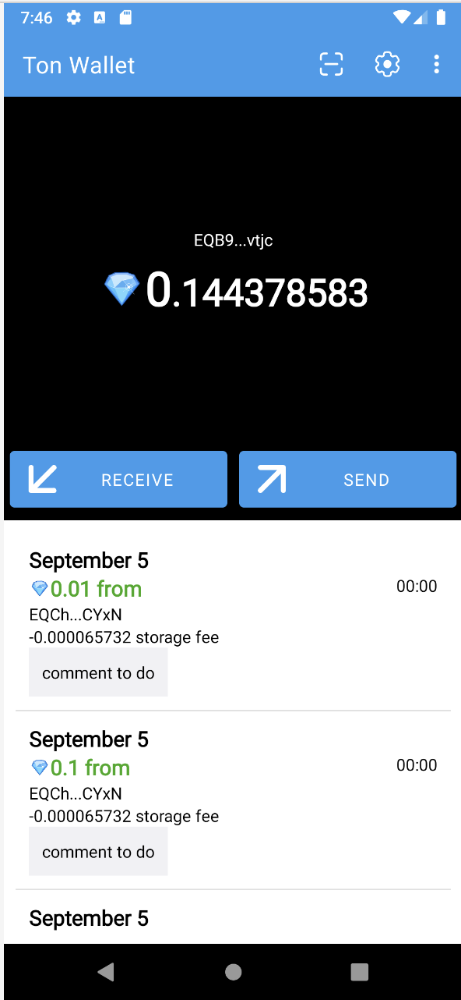
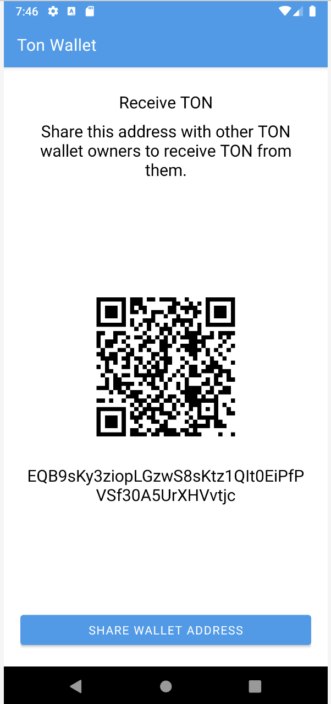
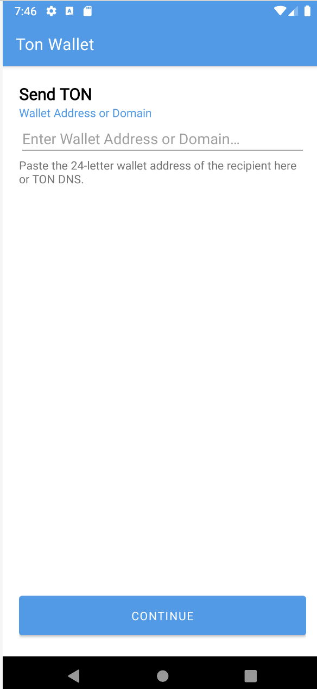
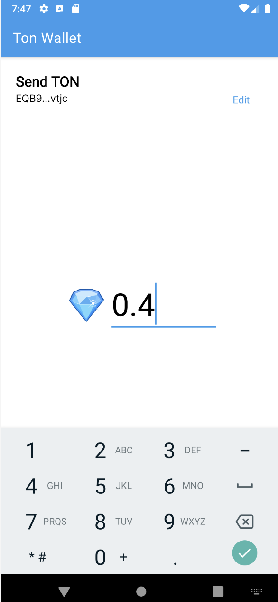
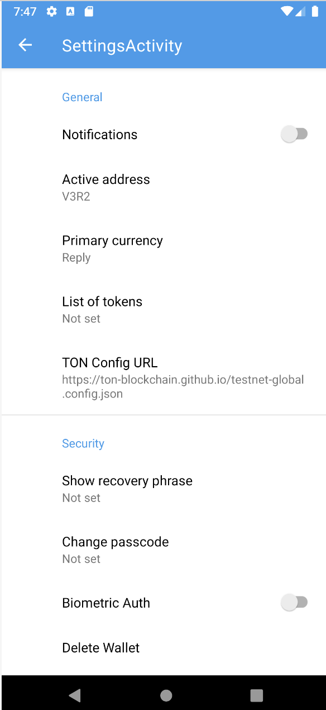
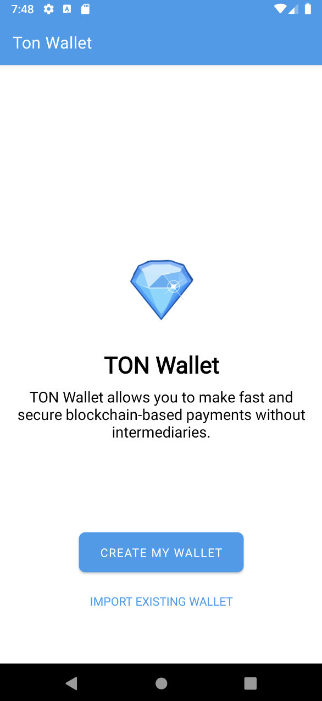
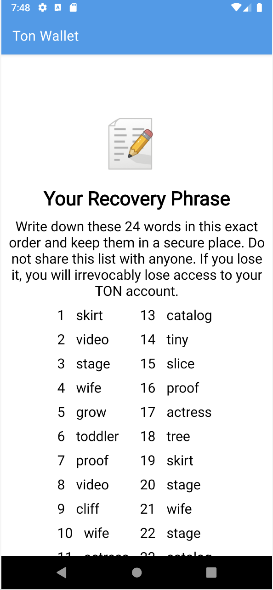
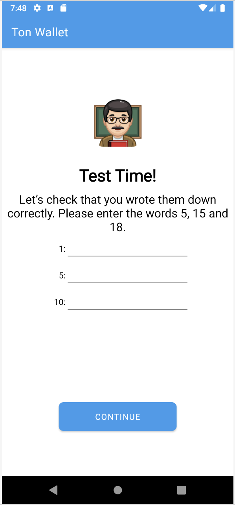
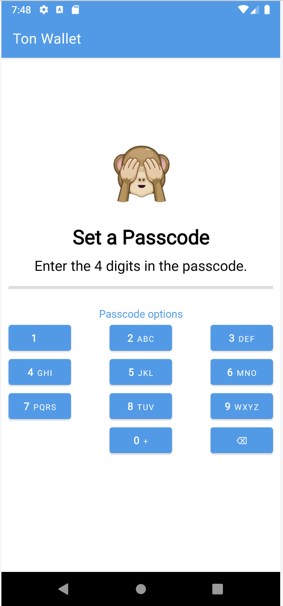
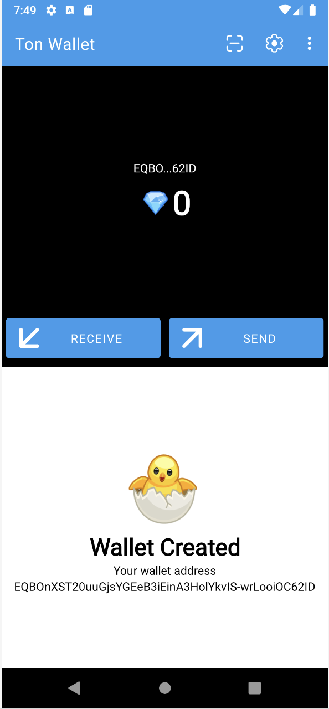
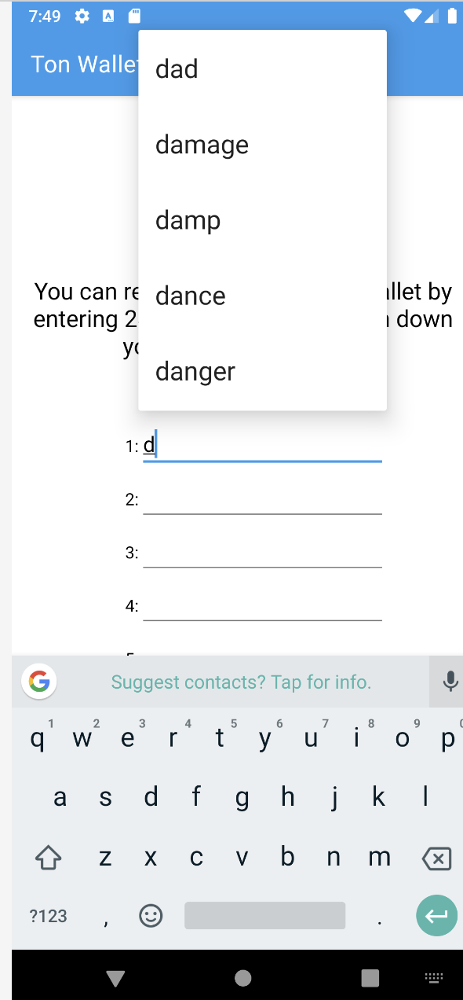

### Todo:

- [ ] security code form
  - [ ] check the code validity
  - [ ] create a model
  - [ ] create interactions between models
  - [ ] use security form when application starts
  - [ ] better positioning on the page
- [ ] create form to enter the secret phrase 
  - [ ] create success layout (it is not needed now)
- [ ] settings pages
  - [ ] make "delete wallet" to be red
  - [ ] use better components for settings
  - [x] list of wallet types
  - [ ] use wallet types in code
- [ ] wallet activity
  - [ ] show transactions and new icon
    - [ ] format list
    - [ ] reverse order
    - [ ] store transaction in case there is no internet
- [ ] send dialog
  - [ ] scan address feature 
- [ ] receive dialog
  - [ ] connect with scanner 
- [ ] scan wallet barcode
  - [x] basic scaning implementation
  - [ ] customize scanning dialog
  - [ ] scan from the wallet activity
  - [ ] populate wallet value to the fragment

### UI Tasks

- [ ] create launch icon

### Links:

- [Figma Design](https://www.figma.com/file/KYK17IdM2ldAAZL540G2hV/TON-Wallet-%C2%B7-Android?type=design&node-id=0-1&t=vzLRrmDAN2Ki4yqm-0)
- [репозиторий конкурса](https://github.com/ton-community/wallet-contest)
    - `git clone git@github.com-maxistar:maxistar/tonwallet.git`
- [video lessons](https://www.youtube.com/watch?v=GcqFhoUuNNI)
- [репозиторий приложения](https://github.com/maxistar/tonwallet)
- [ADNL протокол](https://docs.ton.org/develop/dapps/apis/adnl)
- [tonlib](https://github.com/ton-blockchain/ton/tree/master/example/android)

